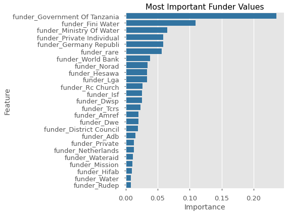
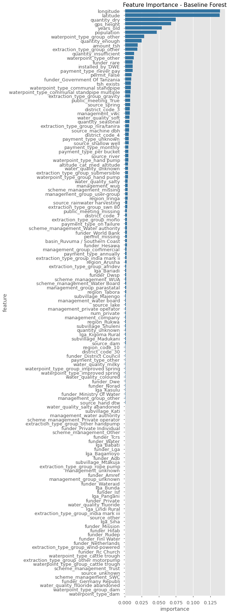

# *Predicting the Condition of Water Pumps in Tanzania.*

Homepage: https://www.drivendata.org/competitions/7/pump-it-up-data-mining-the-water-table/page/23/

***
There are thousands of water pumps in the country of Tanzania, many of which are an integral part of their area's sustainability. However, many of these pumps are known to be in need of maintenance (or not working entirely). 


## Objectives

- The goal is to use data on water pumps in Tanzania to predict the condition of the pump.
- Using this information, we can make smart, data-driven decisions on how to allocate resources in order to maintain / fix pumps which are most in need.
- If successful, the predictions made by these models will be able to improve maintenance operations for these water pumps and significantly improve many people's quality of life.

### Success Criteria
From the competition website:
> **PRIMARY EVALUATION METRIC:**
Classification Rate = $\frac{1}{N}\sum_{i=0}^{N} (y_i = \hat{y}_i)$

> The metric used for this competition is the classification rate, which calculates the percentage of rows where the predicted class $\hat{y}$ in the submission matches the actual class, $y$ in the test set. The maximum is 1 and the minimum is 0. The goal is to maximize the classification rate.

**The current top score is 0.8294** *(23SEP2020)*
- This is the same as the *accuracy score.*
- The target variable is **`status_group`**. This is divided into three categories: `['functional', 'functional needs repair', 'non functional']`.
- It is an unbalanced dataset (there are far more `functional` water pumps).
```
functional                 54 %
non functional             38 %
functional needs repair     7 %
```
- A baseline model (which always guesses a pump to be `functional`) will have an accuracy score of 0.54. 
- **A successful model will have a strong accuracy - the ability to correctly identify as many data points as possible.**

# The Repo
*The repo is divided into two notebooks: **1_processing** and **2_modeling**.*

*The outline for the notebooks can be found below, along with insights and some comments throughout.*

# PART 1 - PROCESSING

## The Data

The data has been collected from Taarifa (http://taarifa.org/) and the Tanzanian Ministry of Water. 

From Taarifa:
> *Taarifa is an open source platform for the crowd sourced reporting and triaging of infrastructure related issues. Think of it as a bug tracker for the real world which helps to engage citizens with their local government. We are currently working on an Innovation Project in Tanzania, with various partners.*


### `train_test_split()`
Even though there is a literal "*test data*" provided for the competition, it is unlabeled and can not be used to verify models.

We will still need a test-train split.

## EDA

***
### Column Descriptions

*From https://www.drivendata.org/competitions/7/pump-it-up-data-mining-the-water-table/page/25/*

- **amount_tsh** - Total static head (amount water available to waterpoint)
- **date_recorded** - The date the row was entered
- **funder** - Who funded the well
- **gps_height** - Altitude of the well
- **installer** - Organization that installed the well
- **longitude** - GPS coordinate
- **latitude** - GPS coordinate
- **wpt_name** - Name of the waterpoint if there is one
- **num_private** -
- **basin** - Geographic water basin
- **subvillage** - Geographic location
- **region** - Geographic location
- **region_code** - Geographic location (coded)
- **district_code** - Geographic location (coded)
- **lga** - Geographic location
- **ward** - Geographic location
- **population** - Population around the well
- **public_meeting** - True/False
- **recorded_by** - Group entering this row of data
- **scheme_management** - Who operates the waterpoint
- **scheme_name** - Who operates the waterpoint
- **permit** - If the waterpoint is permitted
- **construction_year** - Year the waterpoint was constructed
- **extraction_type** - The kind of extraction the waterpoint uses
- **extraction_type_group** - The kind of extraction the waterpoint uses
- **extraction_type_class** - The kind of extraction the waterpoint uses
- **management** - How the waterpoint is managed
- **management_group** - How the waterpoint is managed
- **payment** - What the water costs
- **payment_type** - What the water costs
- **water_quality** - The quality of the water
- **quality_group** - The quality of the water
- **quantity** - The quantity of water
- **quantity_group** - The quantity of water
- **source** - The source of the water
- **source_type** - The source of the water
- **source_class** - The source of the water
- **waterpoint_type** - The kind of waterpoint
- **waterpoint_type_group** - The kind of waterpoint

***

- Most of this is self-explanatory, but I can see there are many redundant columns (eg: source, source_type, source_class). 
- Going though, we'll try to make intelligent choices when it comes to these categories.

### Comments

***

- There are many columns representing **geographical location**. It might be a good idea to compile these columns and thoughtfully select which one/ones are the best predictors.
- There are many columns which seem to be **duplicated** or redundant. It would be worthwhile to see if we can join or remove these columns somehow.
- There are many more categorical columns than continuous columns.

## Feature Engineering

### Creating columns

- Create `years_old` column.
- Make categorical column - `amount_tsh` > 0.
- Engineer `gps_height` into three binned values.
- Engineer column: `installer` == `DWE`.

### Checking seemingly identical columns
- `extraction` vs `extraction_type` vs `extraction_group_type`
- `payment` vs `payment_type`
- `water_quality` vs `quality_group`
- `quantity_group`
- `source_type` and `source_class`.

### Feature Selection with Decision Tree
#### Geographic Columns
Since there are an unbelievable number of categories in some of these columns, I'm going to utilize a Decision Tree Classifier to choose the most important features from these columns. From these, I will drop the column but keep the most important n-columns.

**For example:**

You can see clearly the difference in distribution of functional water pumps based on whether or not a pump belongs to the region Iringa.

#### `funder` Column
Similarly to the geographical columns which were too numerous to include, there are way too many unique categories for `funder`.


Over half of pumps funded by the Government of Tanzania are non-functional.

## Missing Values


## Preprocessing with Pipeline
### Column Transformer


## Feature Selecting: Identify Constant and Correlated Columns

|  | feat1 | feat2 | correlation_coef |  |
|-|-|-|-|-|
303 |	gps_height |	altitude_cat_high_altitude |	0.925433
304 |	gps_height |	altitude_cat_low_altitude |	0.799247
4169 |	lga_Hai |	funder_Germany Republi |	0.981528
5841 |	funder_Germany | Republi	lga_Hai |	0.981528
9087 |	public_meeting_False |	public_meeting_True |	0.751523

### Finding groups of correlated features.

> **The plan**:
- Iterate through each unique feature from the `feat1` column above.
- Find all rows where that feature appears.
- Use these rows to get a list of features (`feat2`) that are highly correlated with the given feature.
- Append all of these features to a list to be sure not to get redundant groups of features.

Each group of correlated features will be a dataframe from the above list.

**For example:**

| | feat1 |	feat2 |	correlation_coef | |
|-|-|-|-|-|
303 |	gps_height |	altitude_cat_high_altitude |	0.925433
304 |	gps_height |	altitude_cat_low_altitude |	0.799247

Now that we have these groups or correlated features, we want to find out which ones to keep. Keeping all of these features can confuse the importance of certain features when modeling.
> **The plan**:
- Use a Decision Tree Classifier for each group of correlated features to pick the most important one.
- Show all groups of features and their respective importances.

**For example:**

| | feature |	importance | |
|-|-|-|-|
2 |	gps_height |	0.999824
0 |	altitude_cat_high_altitude |	0.000161
1 |	altitude_cat_low_altitude |	0.000016

## Dump `num_feature_names` & `cat_feature_names`
Saving feature names for the next notebook.

## Encoding Target
Using LabelEncoder.

## Set `id` back for unlabeled data.
Saving `id` for the competition dataset.

## Writing Processed Data
Saving dataframes.

## Writing Preprocessing Pipeline / LabelEncoder
Saving Pipeline and LabelEncoder.

# PART 2 - MODELING

## Modeling Goals
- The aim of the competition is a plain `accuracy_score` for unlabeled data.
- From a financial perspective, the allocation of maintenance resources is vital, therefore correctly labeling the pumps which are *functional needs repair* and *non functional* can be considered the most important.

### Reload Data
Reload from processing notebook.

## Modeling
In this notebook, we will be using a dummy-classifier and three predictive models.
- Random Forest Classifier
- K-Nearest Neighbors
- XGBoost Classifier

### Baseline - Dummy Classifier

### Random Forest Classifier
#### Vanilla Model
```python
"""
************************************************************************
*        Vanilla Random Forest Classifier Classification Report        *
************************************************************************
                         precision    recall  f1-score   support

             functional       0.81      0.88      0.85      8065
functional needs repair       0.53      0.35      0.42      1079
         non functional       0.84      0.78      0.81      5706

               accuracy                           0.81     14850
              macro avg       0.73      0.67      0.69     14850
           weighted avg       0.80      0.81      0.80     14850
"""
```

Having a vanilla Random Forest score `0.81` accuracy is pretty impressive.


#### Forest GridSearch
For each model type, we will try to tune some parameters to optimize for different metrics.

The model optimized for accuracy is very good with a 0.809 `accuracy`, however it leaves some to be desired with its low `recall_macro`.
> Recall with a **macro-weight** is a harsher metric than "weighted" because it finds a balance between the categories equally, rather than making it more important to correctly identify the more-common categories.

### K-Neighbors Classifier

#### Vanilla Model
```python
"""
******************************************************
*        KNN Classifier Classification Report        *
******************************************************
                         precision    recall  f1-score   support

             functional       0.77      0.86      0.81      8065
functional needs repair       0.48      0.31      0.38      1079
         non functional       0.79      0.71      0.75      5706

               accuracy                           0.76     14850
              macro avg       0.68      0.63      0.65     14850
           weighted avg       0.76      0.76      0.76     14850
"""
```


#### KNN GridSearch

These models aren't showing as much accuracy as the Random Forests, nor do they seem to be better at finding the minority class `functional needs repair`.

### XGBoost

#### Vanilla Model
```python
"""
*************************************************************
*        Vanilla XGBClassifier Classification Report        *
*************************************************************
                         precision    recall  f1-score   support

             functional       0.72      0.93      0.81      8065
functional needs repair       0.62      0.12      0.21      1079
         non functional       0.84      0.61      0.71      5706

               accuracy                           0.75     14850
              macro avg       0.73      0.56      0.57     14850
           weighted avg       0.76      0.75      0.73     14850
"""
```


#### XGB GridSearch

The XGB models are tending to prioritize over-guessing the most common target variable - `functional`.

## Class Imbalance: SMOTE-NC
There are certainly some decent results, but a more balanced training set might help the models predict the minority classes.

- **SMOTENC** is a version of *SMOTE* which can handle one-hot-encoded columns by indicating which columns to treat as categorical.
- It will then create new data points (synthetically) to train on with hopes to get better modeling results.

```python
"""
*********************************************
*        Original Class Distribution        *
*********************************************
0    0.543075
2    0.384242
1    0.072682
Name: status_group, dtype: float64
****************************************
*        Resampled Distribution        *
****************************************
2    0.333333
1    0.333333
0    0.333333
Name: status_group, dtype: float64
"""
```
### Fit re-sampled data.
In some ways, these models are performing much better than with the unbalanced training data.
- They are predicting the minority class *much* more accurately.
- The f1-macro score has increased.

However, their accuracy has diminished due in large part to the number of the majority class (*functional*) which are being mislabeled.

***

Finally, I'm going to try an ensemble with these three classifiers with the SMOTE data to improve the final predictions.

## Creating an Ensemble
### Train Separately on Resampled Data and Original Data
These are two very interesting models.
***
**Original Training Data Model**
- On one hand, we have a model which has a higher overall accuracy (0.81).
- **0.9 recall** for functional water pumps, **0.77 recall** for non-functional pumps.
- The drawback is that more functional needs repair pumps are mislabeled than labeled correctly.

**Resampled Training Data Model**
- The first point to note is the 
- The accuracy is lower (**0.78**), but non functional recall is improved slightly (from 0.77 to **0.79**)
- This model would be good if you especially wanted to try and catch a water pump before it became non functional if it were cheaper to repair it.improvement in the minority class functional needs repair.

## Results
### REAL_TEST predictions
**Random Forest - Original Sampling**

**Ensemble - Original Sampling Method**

**Ensemble - Post-SMOTE-NC Sampling**


## Conclusion & Final Model

While the Ensemble Classifier improved performance by 3%, the computational cost of training the three different classifiers and retrieving their predictions is very large.
Therefore, if I were to deploy a model, I would pick the **Random Forest Classifier**.

The Random Forest has the added benefits of being highly interpretable, very robust to noise and outliers, and is prone not to overfit. 

```python
RandomForestClassifier(bootstrap=False, 
                       criterion='entropy', 
                       min_samples_leaf=3, 
                       random_state=51)
```

### Metrics
#### Full
```python
"""
*********************************************************
*        Final Model - RFC Classification Report        *
*********************************************************
                         precision    recall  f1-score   support

             functional       0.79      0.93      0.85      8065
functional needs repair       0.69      0.25      0.37      1079
         non functional       0.86      0.75      0.80      5706

               accuracy                           0.81     14850
              macro avg       0.78      0.64      0.67     14850
           weighted avg       0.81      0.81      0.80     14850
"""
```
**Precision-Normalization**


- Out of the predicted values, 11% of non-functional wells were mislabeled as functional, while 18% of wells needing repair were functional.
- If the model predicted a functional well, it was correct 79% of the time.

#### Binary
```python
"""
                             precision    recall  f1-score   support

                 functional       0.79      0.93      0.85      8065
needs_repair/non_functional       0.89      0.70      0.78      6785

                   accuracy                           0.82     14850
                  macro avg       0.84      0.81      0.82     14850
               weighted avg       0.83      0.82      0.82     14850
"""
```

| | functional |	needs_repair/non_functional | |
|-|-|-|-|
functional |	7473 |	592
needs_repair/non_functional |	2044 |	4741

- When predicting wells that are not `class_0` (not **functional**), it is correct 88.9% of the time.
 - *(Precision score for `needs_repair/non_functional`)*
- The model is clearly very reliable when asked to find non-functioning wells.
- **Using this model to drive maintenance plans will reduce the number of `non-functional` / `needs repairs` wells by 69.875%.**
 - $\frac{correctly identified}{total existing}$

### Trees

- The `RandomForestClassifier` is an ensemble of n-`DecisionTreeClassifier`s. This model has the default 100 Decision Trees.
- Each tree is fit on a different subset of the training data and therefore has different *opinions* on determining the classification. These trees vote and the Forest uses all of its trees to pick a classification.
- Because of this, we can look "under the hood" at these trees and how they work.


- Orange: `functional`
- Green: `functional needs repair`
- Purple: `non functional`
***
- Each tree above is showing the first three splits for space, but will split down until there are 3 entries per "leaf" which will then determine the classification.
- `Tree_0` uses `quantity_enough` to split into a group where (on the left) 52% of entries are `non functional` and (on the right) 65% of entries are `functional`.
 - ...and so on...

#### Feature Importances


- As you can see the feature importances of these two trees are massively different.
- The trees share an opinion of the relative importance of the `latitude`, `longitude`, and `gps_height` columns.

### Forest Feature Importances


- The full Forest has feature importances based on its 100 estimators (trees).
 - You can see by inspecting the features listed that the Forest is similar to both trees above.
- The overall most important feature according to this Forest is `quantity` - namely whether or not the well is dry.
 - Presumably, dry wells are overwhelmingly non-functional / needing repair.

# Conclusion
## What do I look for to tell if a water pump needs maintenance?

1. **Quantity**: Pay attention to the quantity of water in the well.
 - Wells that are labeled as **dry** are almost all *non functional*.
 - Conversely, less than 25% of wells that have **enough** water are *non functional*.
 - Note: The missing values for this feature are not missing at random (ie: when the label is **unknown**, it is much more likely to be *non functional*).
- **Latitude / Longitude**: While there are functional and non functional wells spread over the country, there do seem to be "pockets" of non-functional wells. This could be due to the water source or other geographical features of an area.
 - If there is a pocket of *non functional* wells in an area, other wells in the same area might be *non functional* as well.
- **Years Old**: Determining the year the well was built and how old it is is a major factor to whether it's working or not.
 - The older a well is, the less likely it is *functional*.
 - New wells are very likely to be *functional*.
 - Wells built before **1990** are more likely to be *non functional* or *needing repair*, while after 1990 are more likely to be *functional*.
- **Extraction Type**: Determining the extraction type will help get very useful information on whether the pump is working.
 - **Gravity** pumps (the most common) are 60% likely to be *functional* and 25% to be *non functional*.
 - The most common type or well to have more *non functional* wells than *functional* is **mono**. These have over a 60% chance to be at least *in need of repair*.
 - Note: Wells that are labeled **other** have a much higher likelihood of being *non functional* than otherwise.
- **Waterpoint Type**: Certain waterpoint types have a strong predictive quality.
 - The most common **communal standpipe** is over 60% likely to be *functional* and 25% to be *non functional*.
 - Having a **communal standpipe multiple** though increases the likelihood of the pump being *non functional* quite a lot.
 - If the waterpoint type is less common (marked **other**), it is almost certainly (over 80%) *non functional*.
 - It seems that **improved spring** wells are the most likely to need repairs (these waterpoint types may require more frequent maintenance than others).
- **Amount Total Static Head**: Most wells have 0 total static head (available static water). Wells that have more than 0 **tsh** are much more likely to be *functional*.
 - As a general principal, the greater the **tsh**, the more likely it is to be *functional*.
